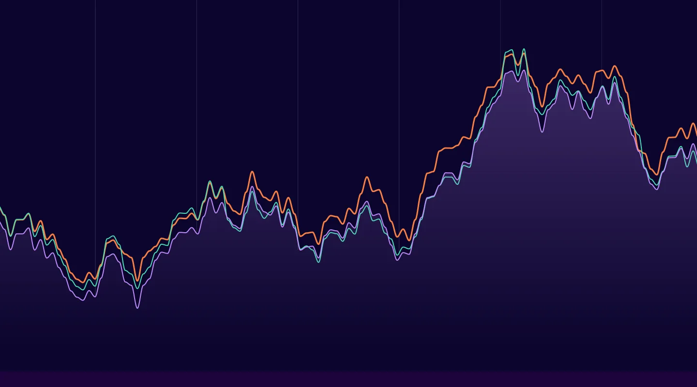

# TimeSeries Cookbook

- [SMA - Simple Moving Average](./notebooks/1.simple_moving_average/)
- [CMA - Cumulative Moving Average](./notebooks/2.cumulative_moving_average/)
- [EMA - Exponential Moving Average](./notebooks/3.exponential_moving_average/)
- [EWMA - Exponential Weighted Moving Average](./notebooks/4.exponential_weighted_moving_average/)
- [ARIMA - AutoRegressive Integrated Moving Average](./notebooks/5.arima/)
- [SARIMAX - Seasonal AutoRegressive Integrated Moving Average Exogenous Regressors](./notebooks/6.sarimax/)
- [Prophet](./notebooks/7.fbprophet/)
- [Darts](./notebooks/8.darts/)

___
- References:
    - [Time Series](https://www.youtube.com/playlist?list=PLZoTAELRMXVNty3jyJkYXuyQY3lMSpr3b)
