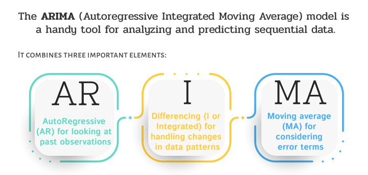

# ARIMA

- ARIMA stands for Autoregressive Integrated Moving Average. It’s a popular statistical analysis model used in time series forecasting. Here’s a breakdown of its components:

    - **Autoregressive (AR):** This part of the model indicates that the evolving variable of interest is regressed on its own prior values.
    - **Integrated (I):** This involves differencing the raw observations to make the time series stationary, which means removing trends or seasonality.
    - **Moving Average (MA):** This part models the relationship between an observation and a residual error from a moving average model applied to lagged observations.

- `ARIMA` models are commonly denoted as `ARIMA(p, d, q)`, where:

    - **p** is the number of lag observations (autoregressive part).
    - **d** is the number of times the raw observations are differenced (integrated part).
    - **q** is the size of the moving average window (moving average part).

- References:
    - [Autoregressive integrated moving average](https://en.wikipedia.org/wiki/Autoregressive_integrated_moving_average)
    - [Autoregressive Integrated Moving Average (ARIMA) Prediction Model](https://www.investopedia.com/terms/a/autoregressive-integrated-moving-average-arima.asp)
    - [What Is ARIMA Modeling?](https://www.mastersindatascience.org/learning/statistics-data-science/what-is-arima-modeling/)